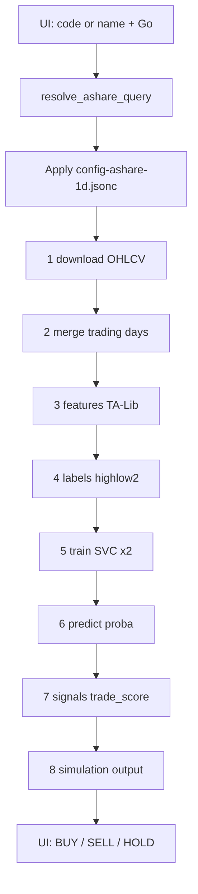

# A-share (沪深) one-click analysis

This document describes the China A-share path added on top of the existing ML offline pipeline: **what data is collected, how it is processed, which model is trained, and how predictions / UI recommendations should be read**.

Default sample: [`configs/config-ashare-1d.jsonc`](../configs/config-ashare-1d.jsonc). Paths below assume `data_folder/symbol/` (e.g. `/app/data/600519/`).

## Scope

| Item | Value |
|------|--------|
| Market | Shanghai / Shenzhen only (`6`/`9` → SH, `0`/`3` → SZ) |
| Frequency | Daily (`freq: "1D"`) |
| Data | akshare (Sina daily preferred; East Money year chunks as fallback) |
| Trading | Not enabled — local signals + `trader_simulation` only |
| UI | Analyze home page: code **or** Chinese name with typeahead |

## Quick start

```bash
bin/start_dev.sh
```

1. Open http://localhost:5174
2. Type `600519` or `贵州茅台` / `茅台`
3. Select a suggestion (mouse or ↑↓ + Enter)
4. Click **Go**
5. Wait for the pipeline; the page shows BUY / SELL / HOLD from the latest row of `signals.csv`

No exchange API keys or Telegram tokens are required.

---

## End-to-end flow

When you click **Go**, the API resolves the code/name, writes the ashare template into the active config, then starts all offline steps:



| Step | Script | Main output |
|------|--------|-------------|
| 1 download | `scripts/download.py` | `{symbol}/klines.csv` |
| 2 merge | `scripts/merge.py` | `{symbol}/data.csv` |
| 3 features | `scripts/features.py` | `{symbol}/features.csv` |
| 4 labels | `scripts/labels.py` | `{symbol}/matrix.csv` |
| 5 train | `scripts/train.py` | `{symbol}/MODELS/` |
| 6 predict | `scripts/predict.py` | `{symbol}/predictions.csv` |
| 7 signals | `scripts/signals.py` | `{symbol}/signals.csv` |
| 8 output | `scripts/output.py` | `{symbol}/transactions.txt` (if a flip occurs) |

CLI equivalent (after config is written):

```console
python -m scripts.download -c configs/config-dev.jsonc
python -m scripts.merge -c configs/config-dev.jsonc
python -m scripts.features -c configs/config-dev.jsonc
python -m scripts.labels -c configs/config-dev.jsonc
python -m scripts.train -c configs/config-dev.jsonc
python -m scripts.predict -c configs/config-dev.jsonc
python -m scripts.signals -c configs/config-dev.jsonc
python -m scripts.output -c configs/config-dev.jsonc
```

---

## 1. What data is collected

**Source:** `inputs/collector_ashare.py` via akshare.

| Field | Meaning |
|-------|---------|
| `timestamp` | Trade date |
| `open` / `high` / `low` / `close` | Daily OHLC, **forward-adjusted (qfq)** |
| `volume` | Daily volume |

- Full history on first run; later runs append from the last date (with a small overlap).
- Prefer Sina `stock_zh_a_daily`; if that fails, East Money is fetched **year by year** (full-range East Money requests often disconnect).
- Stored as `{data_folder}/{code}/klines.csv` (folder name = 6-digit code).

**Merge:** builds a daily calendar index, joins OHLCV, then with `merge_trading_days_only: true` **drops rows where `close` is empty** (weekends / holidays). Result: `{symbol}/data.csv`.

---

## 2. What processing is done

### Features (TA-Lib on `close`)

Generator: `talib` → columns used later as model inputs.

| Indicator | Windows (trading days) | Example columns |
|-----------|------------------------|-----------------|
| SMA | 5, 10, 20, 60 | `close_SMA_5` … `close_SMA_60` |
| LINEARREG_SLOPE | 5, 10, 20, 60 | `close_LINEARREG_SLOPE_5` … |
| STDDEV | 5, 10, 20, 60 | `close_STDDEV_5` … |

These are **absolute** TA values (not relative % transforms).  
`features_horizon: 60` means the first ~60 rows are warm-up for the longest window.

Output: `features.csv` (OHLCV + 12 feature columns).

### Labels (future path “who hits ±3% first”)

Generator: `highlow2` with `horizon: 5`, `thresholds: [3.0]`, `tolerance: 0.2`.

| Label | Question asked of the next 5 daily bars |
|-------|-----------------------------------------|
| `high_30` | Does price **first** rise by **+3%** (using `high`) before falling by the reverse tolerance (~0.6% on `low`)? |
| `low_30` | Does price **first** fall by **−3%** (using `low`) before rising by the reverse tolerance? |

Notes:

- The suffix `_30` is a naming convention for the **3.0%** threshold, **not** “30 days”.
- Labels are boolean / 0–1. The last `label_horizon` (5) rows are excluded from training because the future window is incomplete.
- Output: `matrix.csv` = features + `high_30` + `low_30`.

---

## 3. What model is trained

Configured algorithm (`algorithms`):

```jsonc
{
  "name": "svc",
  "algo": "svc",
  "params": {"is_scale": true, "length": 750},
  "train": {"C": 1.0}
}
```

| Item | Detail |
|------|--------|
| Model | `sklearn.svm.SVC(C=1.0, probability=True)` |
| Scaling | `StandardScaler` fitted on training features (`is_scale: true`) |
| Sample window | Last **750** trading days of usable rows (`length`) |
| Inputs (`train_features`) | The 12 SMA / slope / STDDEV columns above |
| Targets | Two independent binary problems: `high_30` and `low_30` |
| Artifacts | Two model packs under `MODELS/`, keyed as `high_30_svc` and `low_30_svc` |

Training does **not** predict next-day return directly. It estimates whether a **+3% / −3% first-touch** event is likely within the next **5** sessions, given recent trend/volatility features.

---

## 4. How predictions and UI results are interpreted

### Model scores (`predictions.csv`)

Predict step writes **class-1 probabilities** (not hard labels, not raw decision_function):

| Column | Range | Meaning |
|--------|-------|---------|
| `high_30_svc` | ≈ [0, 1] | Estimated P(future +3% first-touch within 5 days) |
| `low_30_svc` | ≈ [0, 1] | Estimated P(future −3% first-touch within 5 days) |

Both can be elevated at once (uncertain / two-sided risk). Metrics (AUC / AP / F1 using threshold 0.5) are appended to `predictions.txt`.

### Combined score and trade rule (`signals.csv`)

1. **`trade_score = high_30_svc − low_30_svc`** (`combine: difference`)  
   - Positive → upside scenario dominates downside  
   - Negative → downside dominates  
   - Near zero → balanced / no edge  

2. **Threshold rule** (defaults in the ashare sample):

| Condition | Signal |
|-----------|--------|
| `trade_score >= 0.08` | `buy_signal_column = true` → **BUY** |
| `trade_score <= -0.08` | `sell_signal_column = true` → **SELL** |
| otherwise | both false → **HOLD** |

So ±0.08 means: “upside probability exceeds downside probability by at least 0.08” (or the reverse), not “price will move 8%”.

### What the Analyze page shows

`GET /api/analyze/result` reads the **last row** of `signals.csv`:

- Recommendation: BUY / SELL / HOLD from the boolean columns above  
- `trade_score` and `close` for that bar  

This is a **research / paper signal**, not a broker order. Output step may append a line to `transactions.txt` only when the **latest** bar flips BUY↔SELL relative to the previous simulation state (`trader_simulation`).

### Practical caveats

- Labels and probabilities are defined on **forward-adjusted** daily bars; corporate actions are already in qfq prices.
- 750-day train window + 5-day label horizon are **defaults** in the sample; change them in config if you retrain for different horizons.
- Threshold `0.08` is a fixed rule in `signal_sets`. The optional `simulate_model.grid` is for separate backtest search, not the default Go path.
- First suggestion/list load can be slow (code/name table cache, 24h TTL).

---

## Configuration highlights

| Field | Sample value | Role |
|-------|--------------|------|
| `venue` | `ashare` | A-share downloader |
| `freq` | `1D` | Daily raster |
| `merge_trading_days_only` | `true` | Drop non-trading empty rows |
| `features_horizon` | `60` | Lookback for longest TA window |
| `label_horizon` | `5` | Drop incomplete label rows when training |
| `algorithms[].params.length` | `750` | Train on last ~3 years of sessions |
| `buy_signal_threshold` / `sell_signal_threshold` | `0.08` / `-0.08` | Map `trade_score` → BUY/SELL |

---

## Code and name resolution

Implementation: [`inputs/collector_ashare.py`](../inputs/collector_ashare.py)

| Helper | Role |
|--------|------|
| `normalize_ashare_symbol` | Extract / validate a 6-digit code |
| `get_ashare_stock_list` | Cached code/name table (`ak.stock_info_a_code_name`, 24h TTL) |
| `search_ashare_stocks` | Typeahead by code prefix or name substring |
| `resolve_ashare_query` | Resolve code or unique name to one code |
| `download_klines` | Batch OHLCV download |

---

## HTTP API

| Method | Path | Body / query | Purpose |
|--------|------|--------------|---------|
| `GET` | `/api/analyze/suggest` | `q`, optional `limit` | Suggestion list `{ code, name, exchange, label }` |
| `POST` | `/api/analyze` | `{ "symbol": "600519" }` or a unique name | Apply ashare template + start full pipeline |
| `GET` | `/api/analyze/result` | optional `symbol` | Latest signal summary |
| `GET` | `/api/pipeline/jobs/{id}/logs` | SSE | Live job logs |

OpenAPI: http://localhost:8000/docs

---

## Data layout

Under `data_folder/{symbol}/`:

| File | Contents |
|------|----------|
| `klines.csv` | Raw daily OHLCV |
| `data.csv` | Merged trading-day series |
| `features.csv` | OHLCV + TA features |
| `matrix.csv` | Features + labels `high_30` / `low_30` |
| `MODELS/` | Scaler + SVC for each label |
| `predictions.csv` | `high_30_svc`, `low_30_svc` (+ price / labels) |
| `signals.csv` | `trade_score`, buy/sell booleans |
| `transactions.txt` | Simulation flips (if any) |

---

## Related docs

- [data-inputs.md](data-inputs.md) — venues and collectors
- [configuration.md](configuration.md) — global parameters including `merge_trading_days_only`
- [features.md](features.md) / [labels.md](labels.md) — generator design
- [scripts.md](scripts.md) — offline script pipeline
- [README.md](../README.md) — microservices ports and UI overview
